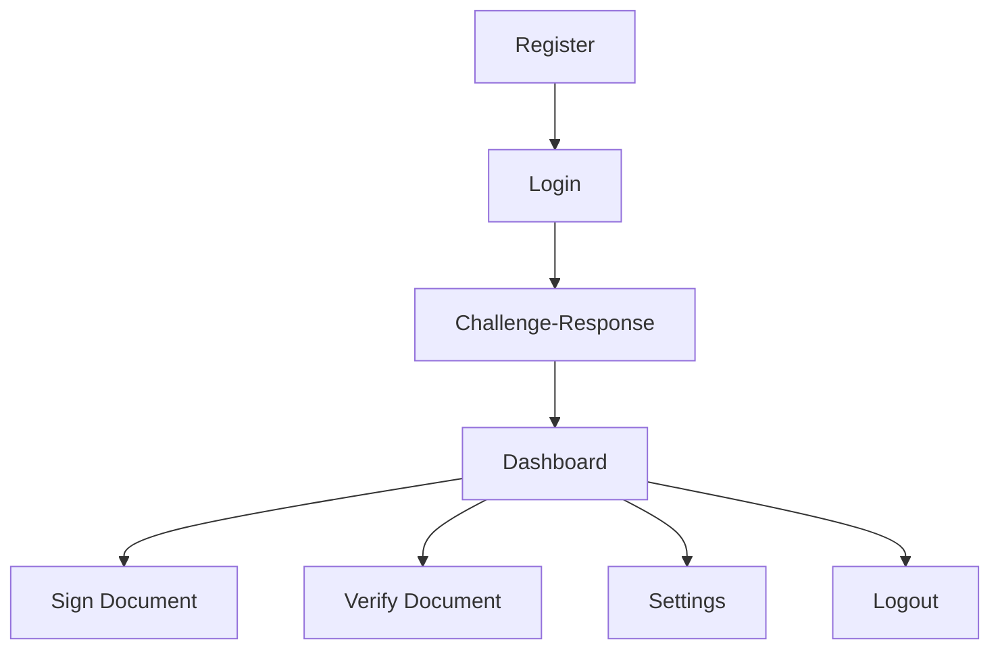

# Signetrix: PKI Document Signing System

A professional, integrated Public Key Infrastructure (PKI) application for secure document signing, verification, and user authentication. Built for robust security, usability, and real-world digital trust.

---

## 🚀 Project Overview

Signetrix is a unified PKI platform that empowers users to securely sign and verify documents using digital certificates, strong cryptography, and a modern, user-friendly interface. The system is ideal for legal, business, and government workflows where document integrity and user authentication are paramount.

---

## 🌟 Key Features

- **User Registration** with password, RSA key generation, and CA-signed certificate
- **User Authentication** with password, challenge-response, and certificate validation
- **Document Signing** using RSA-PSS digital signatures
- **Document Verification** with signature and certificate validation
- **Integrated Certificate Authority (CA)**
- **Private Key Encryption** (AES-256, password-protected)
- **Account Lockout** after failed login attempts
- **Settings** for password change and key re-encryption
- **Help/Use Case** button for user guidance
- **Interactive CLI** for security feature testing
- **Professional, scrollable GUI** with real-time feedback

---

## 🖥️ Quick Start

```bash
python pki_system_main.py
```

---

## 🧭 Workflow Overview



---

## 🛡️ Security Architecture

- **RSA-2048** key pairs for all users
- **X.509 certificates** signed by built-in CA
- **Password Hashing**: PBKDF2-HMAC-SHA256 + salt
- **Private Key Encryption**: AES-256, password-based
- **Challenge-Response**: Proof of private key possession
- **Account Lockout**: 5 failed attempts = 1 minute lockout
- **Audit Logging**: (Partial, extensible)
- **Key Management**: Secure generation, storage, and password-based encryption
- **Note:** Key revocation not yet implemented (future enhancement)

---

## 📋 Requirements Table

| Requirement Area        | Status      | Notes/Improvements                 |
| ----------------------- | ----------- | ---------------------------------- |
| PKI User Auth           | ✔️ Complete | Challenge-response, CA, certs      |
| Document Signing/Verify | ✔️ Complete | RSA-PSS, SHA-256, cert check       |
| Security Features       | ✔️ Complete | Passwords, key encryption, lockout |
| Key Management          | ✔️ Partial  | No explicit revocation/CRL         |
| Use Case                | ✔️ Complete | Help button, real-world scenario   |
| Testing/Validation      | ✔️ Complete | Interactive CLI, all test types    |

---

## 📝 Usage Guide

### Registration

- Enter username and password (with confirmation)
- System generates and encrypts keys, issues CA-signed certificate

### Login

- Enter username and password
- Complete challenge-response (sign a challenge file)
- Access dashboard on success

### Dashboard

- **Sign Document**: Select and sign files
- **Verify Document**: Validate signatures and certificates
- **Settings**: Change password (re-encrypts private key)
- **Help**: View use case and guidance
- **Logout**: End session

### Testing

- Run `python test_security_features.py` and select test cases from the interactive menu

---

## 📁 File Structure

```
signetrix/
├── pki_system_main.py          # Main PKI application
├── PKI_SYSTEM_README.md        # Detailed usage guide
├── test_security_features.py   # Security feature tests (interactive CLI)
├── sample_document.txt         # Test document
├── keys/                       # Encrypted private/public keys
├── certs/                      # CA-signed X.509 certificates
└── signed_docs/                # Signed documents + signatures
```

---

## ❓ Why Signetrix?

- **All-in-one**: Registration, authentication, signing, and verification in one app
- **Professional UX**: Modern, scrollable, and intuitive interface
- **Real Security**: CA, challenge-response, password protection, and more
- **Extensible**: Designed for real-world use and future enhancements

---

## 📞 Contact & Support

For questions, support, or contributions, please contact the project maintainer or open an issue in the repository.

---

**Signetrix: Secure. Professional. Trusted.**
